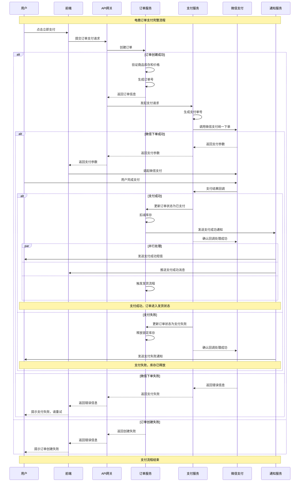

# 订单支付时序图示例

## Mermaid代码

## 使用说明

1. 复制上述Mermaid代码
2. 在 [Mermaid Live Editor](https://mermaid.live/) 中粘贴
3. 即可看到完整的支付流程时序图

## 关键特点

- **完整流程**：覆盖从用户点击支付到支付完成的全流程
- **异常处理**：包含订单创建失败、支付失败等异常情况
- **并行处理**：展示支付成功后的并行通知流程
- **状态管理**：清晰展示订单状态的变化过程

## 适用场景

- 系统设计评审
- 开发团队技术交流
- 测试用例设计
- 问题排查和优化