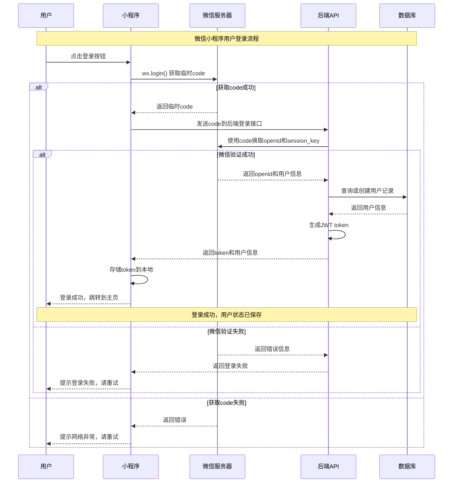
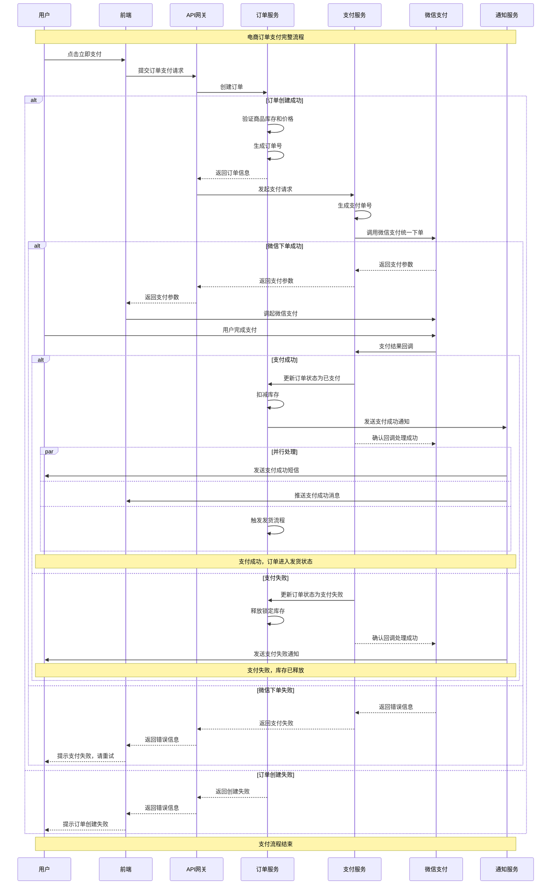
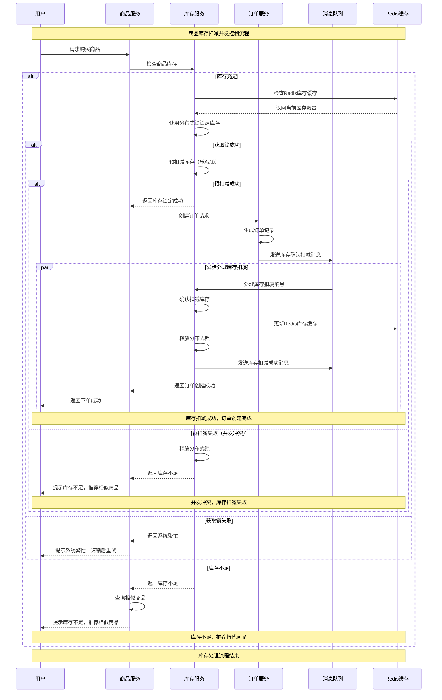

# 软件开发图表生成提示词库

> **专业级图表生成工具库 - 让复杂概念一目了然，让技术架构清晰可见**

## 使用指南

### 文档目的
本文档收集整理了**13种软件开发常用图表的专业级AI生成提示词**，基于业界最佳实践设计，帮助开发人员：
- **专业美观**：生成符合设计规范的高质量图表，具有视觉冲击力
- **认知升级**：让观看者产生"恍然大悟"的理解效果
- **技术精准**：确保图表在技术层面准确无误，可直接用于生产
- **即用即改**：生成的图表代码可根据需求快速调整和优化

### 设计哲学
**"少即是多"** - 每个图表元素都必须有存在的理由，专注于传达核心概念而非装饰
**"技术美学"** - 将复杂的技术概念简化为最直观的视觉形式
**"认知友好"** - 优化信息层次，让复杂系统变得易于理解

### 使用方法
1. **选择图表类型**：根据开发阶段和具体需求选择图表
2. **复制专业提示词**：直接复制对应的生成提示词
3. **输入AI工具**：粘贴到ChatGPT、Claude、文心一言等大模型
4. **获取专业图表**：AI直接输出高质量的图表代码
5. **渲染和优化**：在对应工具中渲染，根据需要微调

### 图表覆盖范围
涵盖软件开发全生命周期的**13种核心图表**，每个提示词都经过专业优化：

| 开发阶段 | 图表类型 | 输出格式 | 专业特色 |
|---------|---------|---------|---------|
| 需求分析 | 用例图、业务流程图、用户旅程图 | PlantUML、BPMN、Mermaid | 业务逻辑清晰，用户体验可视化 |
| 架构设计 | 系统架构图、C4模型、部署图 | PlantUML、SVG、Mermaid | 技术架构专业，层次分明 |
| 详细设计 | ER图、时序图、状态图、API图 | PlantUML、SQL、Swagger | 设计细节精确，开发指导性强 |
| 实现测试 | 代码架构图、测试用例图 | Mermaid、XMind | 代码结构清晰，测试覆盖全面 |
| 部署运维 | 监控仪表盘 | JSON配置、YAML | 运维监控专业，指标体系完整 |

---

## 目录
- [需求分析阶段](#需求分析阶段)
- [架构设计阶段](#架构设计阶段)
- [详细设计阶段](#详细设计阶段)
- [实现阶段](#实现阶段)
- [测试阶段](#测试阶段)
- [部署运维阶段](#部署运维阶段)
- [实际示例](#实际示例)

---

## 需求分析阶段

### 1. 用例图 (Use Case Diagram)
**推荐AI工具**: Claude + PlantUML渲染器  
**专业输出**: PlantUML代码 → 标准UML用例图  

#### 专业级AI生成提示词（直接复制使用）
```shell
你是一名资深的系统分析师和UML设计专家，精通业务建模和用例分析。

请为【微信电商小程序】生成专业级PlantUML用例图代码，遵循以下设计哲学和技术规范：

【设计哲学】
- 采用"业务驱动"的设计理念，每个用例都必须对应真实业务价值
- 专注于核心业务流程，避免技术实现细节干扰
- 通过清晰的视觉层次展现系统边界和参与者关系
- 让观看者能够在30秒内理解整个系统的业务全貌

【视觉设计规范】
- 使用专业配色：参与者(#2196F3蓝色系)、用例(#9C27B0紫色系)、系统边界(#4CAF50绿色系)
- 采用黄金比例布局，确保视觉平衡和美感
- 字体层次：标题14px、参与者12px、用例11px
- 保持40%以上的留白空间，让图表"呼吸"
- 使用标准UML 2.0符号，确保专业性

【技术规范】
- 输出完整PlantUML代码，包含@startuml和@enduml标签
- 代码结构清晰，包含适当注释和分组
- 优化元素布局，避免连线交叉和重叠
- 确保在移动端显示时保持可读性
- 总元素数量控制在50个以内，确保渲染性能

【业务内容要求】
参与者层次：
- 主要参与者：普通用户、商家用户
- 次要参与者：系统管理员
- 外部系统：微信支付系统、物流系统

核心用例分类：
- 用户基础功能：注册登录、个人信息管理
- 商品相关功能：浏览商品、搜索商品、商品详情
- 交易相关功能：购物车管理、下单支付、订单管理
- 商家功能：商品管理、订单处理、数据分析
- 系统管理：用户管理、系统配置、数据统计

关系类型应用：
- 关联关系(-->)：参与者与用例的基本交互
- 包含关系(include)：必须执行的子用例
- 扩展关系(extend)：可选的功能扩展
- 泛化关系：参与者或用例的继承关系

【布局优化策略】
- 参与者按重要性从上到下分布，间距200px
- 用例按功能模块分层排列：基础功能层、业务功能层、管理功能层
- 系统边界清晰包含所有内部用例
- 添加必要的业务规则注释和图例说明

【质量检验标准】
- 业务完整性：是否覆盖了所有核心业务场景
- 视觉清晰度：是否能快速理解系统功能边界
- 技术准确性：UML语法是否标准，关系是否正确
- 实用价值：是否能指导后续的系统设计工作

请直接输出符合以上专业标准的PlantUML代码，确保代码可直接在PlantUML编辑器中完美渲染。
```

#### 专业使用技巧

- **渲染优化**：在 [PlantUML Online](http://www.plantuml.com/plantuml/uml/) 中渲染，支持SVG导出
- **业务定制**：替换"微信电商小程序"为具体项目，调整参与者和用例
- **复杂度控制**：可要求AI生成简化版或详细版，适应不同场景需求

---

### 2. 业务流程图 (Business Process Diagram)
**推荐AI工具**: Claude + BPMN.io渲染器  
**专业输出**: BPMN 2.0 XML → 标准业务流程图  

#### 专业级AI生成提示词（直接复制使用）
```
你是一名BPMN建模专家，请为【微信电商小程序购买流程】生成专业的BPMN 2.0 XML代码。

【核心要求】
- 生成完整可用的BPMN 2.0 XML，可直接在BPMN.io中打开
- 包含完整的图形布局信息，确保所有元素和连线都能正确显示
- 使用标准的BPMN符号和规范

【流程设计】
主要参与者：用户、小程序系统、微信支付
核心流程：商品浏览 → 加入购物车 → 登录验证 → 下单 → 支付 → 发货 → 收货

关键节点：
1. 开始事件：用户进入小程序
2. 用户任务：浏览商品、查看详情、加入购物车
3. 网关决策：是否已登录、库存是否充足、支付是否成功
4. 系统任务：创建订单、库存检查、支付处理、订单状态更新
5. 结束事件：订单完成

【布局要求】
- 使用泳道分离不同参与者的职责
- 从左到右的流程方向
- 合理的元素间距，避免重叠
- 清晰的连线路径

【技术规范】
- 输出标准BPMN 2.0 XML格式
- 包含bpmndi命名空间的完整布局信息
- 每个流程元素都要有对应的图形定义
- 每条连线都要有完整的路径坐标

请直接输出完整的XML代码，确保可以在BPMN.io等工具中正常打开和显示。
```

**使用技巧**:

- **简化描述**：先用简单的业务描述，让AI理解核心流程
- **分步生成**：如果一次生成效果不好，可以先生成流程逻辑，再要求完善布局
- **工具验证**：生成后立即在 [BPMN.io](https://demo.bpmn.io/) 中测试效果

---

### 3. 用户旅程图 (User Journey Map)
**推荐AI工具**: Claude + Mermaid Live Editor  
**专业输出**: Mermaid代码 → 用户体验旅程图  

#### 专业级AI生成提示词（直接复制使用）
```
你是一名用户体验设计专家，请为【微信电商小程序用户购买旅程】生成Mermaid用户旅程图代码。

【核心要求】
- 生成完整可用的Mermaid journey代码，可直接在Mermaid Live Editor中渲染
- 优化文本长度，防止微笑图标被文字遮挡
- 合理分段，提升可读性

【旅程设计原则】
- 用户中心视角：关注用户情感变化和体验痛点
- 情感评分：1-10分制，5分中性，7+正面，3-负面
- 阶段划分：认知→兴趣→考虑→购买→使用→忠诚

【布局优化要求】
- 使用多个section实现S型布局，每个section包含3-4个步骤
- 控制每个任务描述在8个字符以内，避免遮挡图标
- 按时间顺序合理分段，保持逻辑连贯性
- 确保情感评分准确反映用户体验状态

【具体旅程节点】
认知阶段：朋友圈广告(6分) → 群内分享(7分) → 点击进入(7分)
兴趣阶段：浏览首页(7分) → 查看推荐(6分) → 搜索商品(6分)
考虑阶段：查看详情(7分) → 阅读评价(5分) → 价格对比(6分)
购买阶段：加入购物车(8分) → 填写订单(7分) → 完成支付(9分)
使用阶段：物流跟踪(7分) → 收到商品(8分) → 使用体验(8分)
忠诚阶段：评价商品(8分) → 推荐朋友(9分) → 再次购买(10分)

【技术规范】
- 使用标准Mermaid journey语法
- 正确设置section和task格式
- 情感评分使用1-10整数
- 确保代码格式正确，可直接运行

请直接输出完整的Mermaid代码，确保可以在mermaid.live等工具中正常打开和显示。
```

**使用技巧**:

- **文本精简**：每个步骤描述控制在6-8个字符，避免图标遮挡
- **分段布局**：使用多个section创建S型流程，提升可读性
- **情感校准**：根据实际用户反馈调整情感评分的准确性
- **工具验证**：生成后立即在https://mermaid.live/中测试效果

---

## 架构设计阶段

### 4. 系统架构图 (System Architecture Diagram)
**推荐AI工具**: Claude + SVG渲染器  
**专业输出**: SVG源码 → 分层系统架构图  

#### 专业级AI生成提示词（直接复制使用）
```shell
*****
# 微信电商小程序系统

## 用户接入层
- 微信小程序端：商品浏览、购物下单、支付结算、个人中心
- 商家管理端：商品管理、订单处理、数据统计、营销活动  
- 平台管理端：用户管理、系统配置、数据分析、运营监控

## 应用服务层
- 用户服务：注册登录、个人信息、权限管理
- 商品服务：商品展示、库存管理、价格策略
- 订单服务：订单创建、状态跟踪、售后处理
- 支付服务：支付集成、交易记录、退款处理
- 推荐服务：智能推荐、个性化展示
- 搜索服务：商品搜索、筛选排序
- 营销服务：优惠券、促销活动、会员体系
- 消息服务：站内消息、推送通知、短信邮件

## 服务支撑层
- API网关：接口路由、限流熔断、安全认证
- 配置中心：配置管理、动态更新、环境隔离
- 消息队列：异步处理、削峰填谷、事件驱动
- 监控告警：性能监控、日志收集、异常告警

## 数据存储层
- MySQL主从：用户数据、订单数据、商品信息
- Redis集群：缓存数据、会话存储、计数器
- 对象存储：商品图片、用户头像、文件资源
- CDN加速：静态资源、图片加速、全球分发

## 基础设施层
- 容器编排：Kubernetes、Docker、微服务部署
- 负载均衡：流量分发、健康检查、故障转移
- 云服务：弹性计算、自动扩缩容、高可用部署
*****

为以上内容设计一张软件系统的功能架构图，并输出SVG源码。

要求如下：
1、图片样式：系统架构图，上层靠近客户，下层靠近底层，采用现代简洁风格
2、内容以*****之间内容为准，按照分层架构组织
3、请仔细分析内容，保证层次清晰、图形不要重叠或者覆盖
4、注意不同层图形包裹效果，不要溢出
5、组件布局要求：
   - 用户接入层：3个组件水平均匀分布，组件间距相等
   - 应用服务层：上排4个核心服务，下排4个扩展服务，每排内部均匀分布
   - 服务支撑层：4个组件水平均匀分布，组件间距相等
   - 数据存储层：4个组件水平均匀分布，组件间距相等
   - 基础设施层：3个组件水平均匀分布，组件间距相等
6、尺寸规范：每层内组件宽度一致，高度根据内容适配，左右边距保持一致
7、使用专业配色方案，每层使用不同颜色系
8、组件内文字居中对齐，确保可读性
9、字体颜色要求：组件标题使用深色字体（#1a1a1a），组件描述使用深灰色字体（#333333），确保在浅色背景上清晰可见
10、字体大小要求：层标题18px，组件标题15px，组件描述11px，确保层次分明
11、间距规范：层与层之间间距40px，组件与组件之间间距20px，组件与层边界间距30px
```

**使用技巧**:

- **快速预览**：在 https://uutool.cn/svg-preview/ 中粘贴SVG代码即可预览
- **项目定制**：将"微信电商小程序系统"替换为具体项目名称
- **内容调整**：修改*****之间的系统描述内容，保持分层结构
- **格式转换**：可在 https://uutool.cn/svg2jpg/ 转换为JPG格式

---

### 5. C4模型架构图 (C4 Model Architecture)
**推荐AI工具**: Claude + PlantUML渲染器  
**专业输出**: PlantUML C4代码 → 分层架构视图  
**生成时间**: 约50秒

#### 专业级AI生成提示词（直接复制使用）
```
请为【微信电商小程序系统】生成清晰简洁的PlantUML C4模型代码。

【核心要求】
- 输出完整PlantUML代码，包含C4标准库引用
- 使用标准C4语法：Person、System、Container、Component
- 代码可直接在PlantUML编辑器中渲染
- 平衡显示完整性和清晰度

【清晰度优化设置】
- 使用LAYOUT_TOP_DOWN()布局，更清晰的层次
- 设置skinparam defaultFontSize 10，保持可读性
- 设置skinparam minClassWidth 180，适中宽度
- 设置skinparam wrapWidth 150，合理换行
- 使用适当的组件间距，避免拥挤
- 保持简洁但清晰的描述

【精简的C4设计】
Level 1 - 系统上下文（5个核心实体）：
- 参与者：普通用户、商家用户
- 核心系统：微信电商平台
- 外部系统：微信生态、支付系统

Level 2 - 容器图（6个核心容器）：
- 前端：小程序、商家后台
- 后端：API网关、业务服务
- 存储：MySQL、Redis

Level 3 - 组件图（4个核心组件）：
- 用户组件：认证模块
- 商品组件：目录管理
- 订单组件：订单引擎
- 支付组件：支付网关

【文字描述优化】
- 组件名称：6-8个字符，简洁明了
- 技术标注：保留关键技术栈
- 关系描述：使用清晰的动词
- 避免过度简化导致的歧义

【布局平衡策略】
- 使用适度的组件分组，提升可读性
- 保持合理的组件间距
- 优化连线布局，减少交叉
- 确保图例清晰可见

【显示优化】
- 页面边距设置为15px，确保完整显示
- 背景色设置为白色，提升对比度
- 字体颜色使用深色，确保清晰可读
- 组件边框适中，不过粗不过细

请直接输出符合以上要求的优化PlantUML C4代码，确保清晰度和完整性的最佳平衡。
```

#### 专业使用技巧

- **架构沟通**：在 [PlantUML Online](http://www.plantuml.com/plantuml/uml/) 渲染，用于架构评审
- **分层展示**：可要求AI分别生成Context、Container、Component三个层次的图
- **架构演进**：基于C4模型规划系统架构的演进路径

---

### 6. 部署架构图 (Deployment Architecture)
**推荐AI工具**: Claude + draw.io渲染器  
**专业输出**: draw.io XML源码 → 专业部署拓扑图  

#### 专业级AI生成提示词（直接复制使用）
```
请生成draw.io XML格式的【微信电商小程序系统】部署架构图，包含以下层次：
1. 【用户接入层】：包含微信小程序端、移动端App、Web管理端、商家后台
2. 【CDN加速层】：包含CloudFront全球分发、边缘缓存节点、DNS解析服务
3. 【安全防护层】：包含WAF防火墙、DDoS防护、SSL证书管理、IAM权限控制
4. 【负载均衡层】：包含ALB应用负载均衡、API网关、流量分发
5. 【Web服务层】：包含Nginx集群（2C4G * 3台，跨AZ部署）
6. 【应用服务层】：包含用户服务、商品服务、订单服务、支付服务、通知服务、消息队列RabbitMQ、配置中心Nacos
7. 【缓存服务层】：包含Redis集群（3主3从，4C8G配置）
8. 【数据存储层】：包含RDS MySQL主从部署（8C16G）、S3对象存储、备份存储

【核心要求】
- 使用专业的架构图风格
- 组件间要有清晰的连接关系
- 标注关键技术栈和配置信息
- 输出完整的draw.io XML格式源代码
- 可直接在draw.io中导入和编辑
```

#### 专业使用技巧
- **直接导入**：在 [draw.io](https://app.diagrams.net/) 中选择"文件→导入"，粘贴XML代码即可
- **在线编辑**：支持在线编辑和实时协作，便于团队讨论架构方案
- **多格式导出**：可导出为PNG、JPG、SVG、PDF等多种格式
- **版本管理**：可保存到Google Drive、OneDrive等云盘，支持版本历史
- **模板复用**：保存为模板，可快速应用到其他项目的架构设计
- **运维指导**：生成的部署图可直接用于运维手册和故障处理
- **架构演进**：通过版本对比功能跟踪架构的演进历程

---

### 7. 数据库ER图 (Entity Relationship Diagram)
**推荐AI工具**: Claude + dbdiagram.io渲染器  
**专业输出**: DBML代码 → 专业ER图  


#### 专业级AI生成提示词（直接复制使用）
```
你是一名资深的数据库架构师和数据建模专家，具有大型电商系统数据库设计的丰富经验。

请为【微信电商小程序数据库】生成专业级DBML代码，遵循以下设计哲学和技术规范：

【设计哲学】
- 突出"数据一致性"和"查询性能"的平衡，优化关键业务场景
- 通过标准化的数据库设计范式，确保数据质量和维护性
- 让观看者能够理解业务数据的完整生命周期和关联关系

【数据建模原则】
- 适度反范式：关键查询路径优化，提升查询性能
- 数据完整性：主键、外键、唯一约束、检查约束
- 扩展性设计：预留扩展字段，支持业务发展
- 安全性考虑：敏感数据加密，访问权限控制

【视觉设计规范】
- 使用DBML标准语法和dbdiagram.io渲染
- 专业配色：核心实体(#2196F3)、关联实体(#4CAF50)、配置实体(#FF9800)
- 关系标注：一对一(1:1)、一对多(1:n)、多对多(m:n)
- 字段类型：明确标注数据类型、长度、约束
- 索引标注：主键、唯一索引、普通索引、复合索引

【技术规范】
- 输出完整的DBML代码，符合dbdiagram.io标准
- 代码可直接在dbdiagram.io中导入渲染
- 表名和字段名使用标准命名规范
- 包含必要的注释和业务规则说明
- 确保代码格式正确，可被标准工具解析

【核心业务实体设计】
用户域 (User Domain)：
- users：用户基础信息表
  * id (bigint, PK)：用户唯一标识
  * openid (varchar(64), UK)：微信openid
  * unionid (varchar(64), UK)：微信unionid
  * nickname (varchar(50))：用户昵称
  * avatar_url (varchar(255))：头像URL
  * gender (tinyint)：性别 1男2女0未知
  * phone (varchar(20), UK)：手机号码
  * email (varchar(100))：邮箱地址
  * status (tinyint)：状态 1正常2禁用
  * created_at (timestamp)：创建时间
  * updated_at (timestamp)：更新时间

- user_addresses：用户地址表
  * id (bigint, PK)：地址ID
  * user_id (bigint, FK)：用户ID
  * receiver_name (varchar(50))：收货人姓名
  * receiver_phone (varchar(20))：收货人电话
  * province (varchar(20))：省份
  * city (varchar(20))：城市
  * district (varchar(20))：区县
  * detail_address (varchar(200))：详细地址
  * is_default (tinyint)：是否默认地址
  * created_at (timestamp)：创建时间

商品域 (Product Domain)：
- categories：商品分类表
  * id (bigint, PK)：分类ID
  * parent_id (bigint)：父分类ID
  * name (varchar(50))：分类名称
  * level (tinyint)：分类层级
  * sort_order (int)：排序权重
  * icon_url (varchar(255))：分类图标
  * status (tinyint)：状态 1启用0禁用
  * created_at (timestamp)：创建时间

- products：商品主表
  * id (bigint, PK)：商品ID
  * category_id (bigint, FK)：分类ID
  * merchant_id (bigint, FK)：商家ID
  * name (varchar(100))：商品名称
  * subtitle (varchar(200))：商品副标题
  * description (text)：商品描述
  * main_image (varchar(255))：主图URL
  * price (decimal(10,2))：销售价格
  * original_price (decimal(10,2))：原价
  * stock (int)：库存数量
  * sales_count (int)：销量统计
  * status (tinyint)：状态 1上架2下架3删除
  * created_at (timestamp)：创建时间
  * updated_at (timestamp)：更新时间

- product_skus：商品SKU表
  * id (bigint, PK)：SKU ID
  * product_id (bigint, FK)：商品ID
  * sku_code (varchar(50), UK)：SKU编码
  * attributes (json)：规格属性JSON
  * price (decimal(10,2))：SKU价格
  * stock (int)：SKU库存
  * image_url (varchar(255))：SKU图片
  * status (tinyint)：状态
  * created_at (timestamp)：创建时间

订单域 (Order Domain)：
- orders：订单主表
  * id (bigint, PK)：订单ID
  * order_no (varchar(32), UK)：订单号
  * user_id (bigint, FK)：用户ID
  * merchant_id (bigint, FK)：商家ID
  * total_amount (decimal(10,2))：订单总金额
  * discount_amount (decimal(10,2))：优惠金额
  * freight_amount (decimal(10,2))：运费
  * pay_amount (decimal(10,2))：实付金额
  * pay_type (tinyint)：支付方式
  * status (tinyint)：订单状态
  * receiver_info (json)：收货信息JSON
  * remark (varchar(500))：订单备注
  * created_at (timestamp)：创建时间
  * paid_at (timestamp)：支付时间
  * shipped_at (timestamp)：发货时间
  * completed_at (timestamp)：完成时间

- order_items：订单商品表
  * id (bigint, PK)：明细ID
  * order_id (bigint, FK)：订单ID
  * product_id (bigint, FK)：商品ID
  * sku_id (bigint, FK)：SKU ID
  * product_name (varchar(100))：商品名称
  * sku_attributes (varchar(200))：SKU属性
  * price (decimal(10,2))：商品单价
  * quantity (int)：购买数量
  * total_amount (decimal(10,2))：小计金额
  * created_at (timestamp)：创建时间

支付域 (Payment Domain)：
- payments：支付记录表
  * id (bigint, PK)：支付ID
  * payment_no (varchar(32), UK)：支付单号
  * order_id (bigint, FK)：订单ID
  * user_id (bigint, FK)：用户ID
  * amount (decimal(10,2))：支付金额
  * pay_type (tinyint)：支付方式
  * pay_channel (varchar(20))：支付渠道
  * transaction_id (varchar(64))：第三方交易号
  * status (tinyint)：支付状态
  * paid_at (timestamp)：支付时间
  * created_at (timestamp)：创建时间

【关系设计和约束】
主要关系：
- users 1:n user_addresses (用户-地址)
- categories 1:n products (分类-商品)
- products 1:n product_skus (商品-SKU)
- users 1:n orders (用户-订单)
- orders 1:n order_items (订单-明细)
- orders 1:1 payments (订单-支付)

索引策略：
- 主键索引：所有表的id字段
- 唯一索引：openid, phone, order_no, payment_no
- 普通索引：user_id, product_id, category_id, status
- 复合索引：(user_id, status), (product_id, status)
- 全文索引：product.name, product.description

【数据完整性约束】
检查约束：
- 枚举值检查：status, gender, pay_type等枚举字段
- 数值范围检查：price >= 0, stock >= 0
- 长度检查：varchar字段长度限制
- 格式检查：phone, email格式验证

【性能优化设计】
分区策略：
- 订单表按月分区：提升查询和维护性能
- 日志表按日分区：便于数据清理和归档
- 大表垂直分割：热点字段和冷数据分离

缓存策略：
- 商品信息缓存：Redis缓存热门商品
- 用户会话缓存：登录状态和权限信息
- 计数器缓存：商品销量、库存等实时数据
- 查询结果缓存：复杂查询结果缓存

【数据安全和隐私】
敏感数据处理：
- 手机号脱敏：中间4位用*替换
- 地址信息加密：详细地址AES加密存储
- 支付信息保护：不存储完整银行卡号
- 操作日志：记录敏感操作的审计日志

数据备份：
- 实时备份：binlog实时同步到备库
- 定时备份：每日全量备份，每小时增量备份
- 跨地域备份：重要数据异地备份
- 恢复测试：定期恢复测试验证备份有效性

请直接输出符合以上专业标准的DBML代码，确保数据模型能够支撑电商业务的完整生命周期。
```

#### 专业使用技巧

- **数据建模**：在 [dbdiagram.io](https://dbdiagram.io/) 导入DBML，支持在线编辑
- **SQL生成**：可要求AI基于ER图生成建表SQL和索引优化建议
- **数据迁移**：基于ER图设计数据迁移方案和版本升级策略

---

### 8. 时序图 (Sequence Diagram)
**推荐AI工具**: ChatGPT + PlantUML渲染器  
**专业输出**: PlantUML代码 → 交互时序图  

#### 简化版AI生成提示词（快速使用）
```
请为【业务场景】生成专业时序图代码，使用Mermaid语法：

**核心流程**：
- 参与者：[列出主要参与者]
- 关键步骤：[描述主要业务步骤]
- 异常处理：[说明异常情况]

**输出要求**：
- 使用Mermaid sequenceDiagram语法
- 包含完整的交互流程
- 添加必要的注释和说明
- 代码可直接在Mermaid编辑器中运行
```

#### 快速示例模板

**1. 用户登录流程**
```
请为【微信小程序用户登录】生成时序图：

**核心流程**：
- 参与者：用户、小程序、微信服务器、后端API
- 关键步骤：获取code、换取token、用户信息存储
- 异常处理：登录失败、网络异常
**输出要求**：
- 使用Mermaid sequenceDiagram语法
- 包含完整的交互流程
- 添加必要的注释和说明
- 代码可直接在Mermaid编辑器中运行
```

**2. 订单支付流程**

```
请为【电商订单支付】生成时序图：

**核心流程**：
- 参与者：用户、前端、订单服务、支付网关、第三方支付
- 关键步骤：创建订单、发起支付、支付回调、订单更新
- 异常处理：支付失败、超时处理
**输出要求**：
- 使用Mermaid sequenceDiagram语法
- 包含完整的交互流程
- 添加必要的注释和说明
- 代码可直接在Mermaid编辑器中运行
```

**3. 商品库存扣减**
```
请为【商品库存扣减】生成时序图：

**核心流程**：
- 参与者：用户、商品服务、库存服务、订单服务、消息队列
- 关键步骤：检查库存、锁定库存、创建订单、扣减库存
- 异常处理：库存不足、并发冲突
**输出要求**：
- 使用Mermaid sequenceDiagram语法
- 包含完整的交互流程
- 添加必要的注释和说明
- 代码可直接在Mermaid编辑器中运行
```

#### 具体时序图代码示例

**1. 用户登录流程时序图**



**2. 订单支付流程时序图**


**3. 商品库存扣减时序图**



#### 常用参与者速查表

**前端类**：
- 用户 (User)
- 小程序 (MiniProgram)
- Web页面 (WebPage)
- 移动App (MobileApp)

**后端类**：

- API网关 (APIGateway)
- 用户服务 (UserService)
- 订单服务 (OrderService)
- 支付服务 (PaymentService)
- 商品服务 (ProductService)

**第三方**：

- 微信服务器 (WeChatServer)
- 支付宝 (Alipay)
- 短信服务 (SMSService)
- 物流API (LogisticsAPI)

**基础设施**：
- 数据库 (Database)
- Redis缓存 (Redis)
- 消息队列 (MessageQueue)
- 文件存储 (FileStorage)

#### 专业使用技巧
- **快速生成**：使用简化版模板快速描述需求，AI自动生成专业时序图
- **交互分析**：在 [PlantUML Online](http://www.plantuml.com/plantuml/uml/) 或 [Mermaid Live](https://mermaid.live/) 渲染
- **性能优化**：基于时序图分析系统瓶颈和优化点
- **测试设计**：生成的时序图可直接用于集成测试用例设计
- **文档沟通**：可在Markdown文档中直接嵌入Mermaid代码
- **版本控制**：时序图代码可纳入Git版本管理，跟踪业务流程变更

---

## 实现阶段

### 11. 代码架构图 (Code Architecture Diagram)
**推荐AI工具**: Claude + Mermaid渲染器  
**直接输出**: Mermaid代码 → 可视化架构图  

#### 优化版AI生成提示词（清晰分层结构）
```
请直接生成微信电商小程序后端的Mermaid代码架构图代码，要求：

【输出要求】
- 直接输出完整的Mermaid代码，使用graph TD语法
- 代码可直接在Mermaid编辑器中渲染
- 不要输出设计说明，只要代码

【视觉优化规范】
- 使用subgraph分层结构，保持清晰的层次感
- 节点文本简洁明了，控制在1-2行以内
- 在样式定义中添加font-size:12px，确保文字清晰
- 使用双引号包围所有节点文本
- 外部系统使用圆括号[()]标记，便于区分
- 合理控制连线数量，避免过于复杂

【架构分层设计】
- Controller层：5个控制器（用户、商品、订单、支付、购物车）
- Service层：7个服务（用户、商品、订单、支付、购物车、库存、通知）
- Repository层：6个数据访问层
- Model层：7个实体模型
- Config层：4个配置类
- Util层：4个工具类
- External层：5个外部系统

【颜色编码】
- Controller层背景色：#E3F2FD（浅蓝色）
- Service层背景色：#E8F5E8（浅绿色）
- Repository层背景色：#FFF3E0（浅橙色）
- Model层背景色：#F3E5F5（浅紫色）
- Config层背景色：#ECEFF1（浅灰蓝色）
- Util层背景色：#EFEBE9（浅棕色）
- External层背景色：#FCE4EC（浅粉色）

【节点样式】
- Controller节点：蓝色(#2196F3)
- Service节点：绿色(#4CAF50)
- Repository节点：橙色(#FF9800)
- Model节点：紫色(#9C27B0)
- Config节点：灰蓝色(#607D8B)
- Util节点：棕色(#795548)
- External节点：粉色(#E91E63)

【核心类设计】
Controller层：UserController、ProductController、OrderController、PaymentController、CartController
Service层：UserService、ProductService、OrderService、PaymentService、CartService、InventoryService、NotificationService
Repository层：UserRepository、ProductRepository、OrderRepository、PaymentRepository、CartRepository、InventoryRepository
Model层：User、Product、Order、OrderItem、Payment、Cart、Inventory
Config层：DatabaseConfig、SecurityConfig、RedisConfig、RabbitMQConfig
Util层：JWTUtil、DateUtil、ValidationUtil、Constants
External层：MySQL、Redis、RabbitMQ、微信API、支付网关

【依赖关系设计】
- Controller -> Service：一对一依赖
- Service -> Repository：一对一依赖
- Repository -> Model：一对多依赖
- Repository -> External：数据库连接
- Service -> External：第三方API调用
- 关键配置和工具类依赖

【技术栈标注】
Spring Boot + MyBatis + MySQL + Redis + RabbitMQ

请按照以上规范生成清晰分层的Mermaid代码。
```

#### 使用技巧

- **防遮挡渲染**：生成后可直接在 [Mermaid Live Editor](https://mermaid.live/) 渲染，文字清晰不被遮挡
- **技术栈定制**：可要求AI生成不同技术栈的架构图（如Spring Cloud、Node.js等）
- **层次调整**：可根据项目复杂度调整层次数量和组件数量
- **布局优化**：使用~~~水平布局确保同层元素整齐排列
- **颜色定制**：可根据团队规范调整颜色编码方案
- **适合用于代码结构设计和团队协作**

---

## 测试阶段

### 12. 测试用例图 (Test Case Diagram)
**推荐AI工具**: claude + Mermaid渲染器  
**直接输出**: Mermaid代码 → 可视化思维导图  

#### AI生成提示词（直接复制使用）
```
请直接生成微信电商小程序测试用例的Mermaid思维导图代码，要求：

【输出要求】
- 直接输出完整的Mermaid代码，使用mindmap语法
- 代码可直接在Mermaid编辑器中渲染
- 不要输出设计说明，只要代码

【视觉设计规范】
- 使用思维导图布局，中心节点为"测试用例"
- 使用不同颜色区分功能测试、性能测试、安全测试
- 层级清晰，从测试分类到具体测试点
- 包含测试优先级标注

【测试分类】
功能测试：用户功能、商品功能、订单功能、支付功能
性能测试：响应时间、并发性能、压力测试、稳定性测试
安全测试：身份认证、权限控制、数据安全、接口安全
兼容性测试：浏览器兼容、设备兼容、网络兼容
易用性测试：界面友好性、操作便捷性、错误提示

【具体测试点】
用户功能：注册、登录、信息修改、密码重置
商品功能：商品浏览、搜索、筛选、详情查看
订单功能：下单、支付、查看、取消、退款
支付功能：微信支付、支付回调、异常处理

【测试要素】
- 测试用例编号
- 测试优先级：P0、P1、P2
- 预期结果
- 测试数据
- 前置条件

【测试策略】
- 冒烟测试：核心功能验证
- 回归测试：版本更新验证
- 边界测试：极限值测试
- 异常测试：错误场景测试

请直接生成符合以上要求的Mermaid代码。
```

#### 使用技巧

- 生成后可直接在 [Mermaid Live Editor](https://mermaid.live/) 渲染
- 可要求AI生成具体的测试用例表格
- 适合用于测试计划制定和用例管理

---

## 快速参考：提示词速查表

> **一键复制，直接生成图表代码！所有提示词的精简版本**

### 需求分析阶段
| 图表类型 | 核心提示词 | 输出格式 |
|---------|-----------|---------|
| **用例图** | `请直接生成[项目名]的PlantUML用例图代码，包含【参与者】【用例】【关系】，输出完整PlantUML代码` | PlantUML代码 |
| **业务流程图** | `请直接生成[项目名]的BPMN流程图XML代码，包含【流程节点】【泳道】【异常处理】，输出BPMN XML` | BPMN XML |
| **用户旅程图** | `请直接生成[项目名]的Mermaid用户旅程图代码，包含【旅程阶段】【情感评分】【触点】，输出Mermaid代码` | Mermaid代码 |

### 架构设计阶段
| 图表类型 | 核心提示词 | 输出格式 |
|---------|-----------|---------|
| **系统架构图** | `请直接生成[项目名]的Mermaid系统架构图代码，包含【分层架构】【服务组件】【数据流】，输出Mermaid代码` | Mermaid代码 |
| **C4模型图** | `请直接生成[项目名]的PlantUML C4模型代码，包含【Level 1-4】，输出C4 PlantUML代码` | PlantUML代码 |
| **部署架构图** | `请生成draw.io XML格式的[项目名]部署架构图，包含【用户接入层】【CDN加速层】【安全防护层】【负载均衡层】【Web服务层】【应用服务层】【缓存服务层】【数据存储层】，输出draw.io XML` | draw.io XML |

### 详细设计阶段
| 图表类型 | 核心提示词 | 输出格式 |
|---------|-----------|---------|
| **数据库ER图** | `请直接生成[项目名]的DBML数据库设计代码，包含【核心表】【关系】【索引】，输出DBML代码` | DBML代码 |
| **时序图** | `请为【业务场景】生成时序图，核心流程：参与者[列出]、关键步骤[描述]、异常处理[说明]，使用Mermaid语法输出` | Mermaid代码 |
| **状态图** | `请直接生成[项目名]的PlantUML状态图代码，包含【状态】【转换】【触发条件】，输出PlantUML代码` | PlantUML代码 |
| **API设计图** | `请直接生成[项目名]的OpenAPI YAML代码，包含【RESTful接口】【数据模型】【安全设计】，输出YAML代码` | OpenAPI YAML |

### 实现测试阶段
| 图表类型 | 核心提示词 | 输出格式 |
|---------|-----------|---------|
| **代码架构图** | `请直接生成[项目名]的Mermaid代码架构图代码，使用subgraph分层结构，包含【Controller层】【Service层】【Repository层】【Model层】，输出Mermaid代码` | Mermaid代码 |
| **测试用例图** | `请直接生成[项目名]的Mermaid测试用例思维导图代码，包含【测试分类】【测试点】【优先级】，输出Mermaid代码` | Mermaid代码 |

## AI使用最佳实践

### 提示词优化技巧
1. **明确输出格式**：始终要求AI直接输出代码，不要设计说明
2. **具体化项目信息**：将`[项目名]`替换为具体项目名称
3. **指定代码语法**：明确要求PlantUML、Mermaid、DBML等具体语法
4. **要求完整代码**：确保输出的代码可直接复制使用

### 常用渲染工具推荐
| 图表类型 | 推荐工具 | 在线地址 |
|---------|---------|---------|
| **PlantUML** | PlantUML Online | http://www.plantuml.com/plantuml/uml/ |
| **Mermaid** | Mermaid Live Editor | https://mermaid.live/ |
| **BPMN** | BPMN.io | https://demo.bpmn.io/ |
| **DBML** | dbdiagram.io | https://dbdiagram.io/ |
| **OpenAPI** | Swagger Editor | https://editor.swagger.io/ |
| **draw.io** | draw.io | https://app.diagrams.net/ |

### 效率提升建议
- **建立代码库**：保存生成的图表代码，建立项目模板
- **版本控制**：用Git管理图表代码的版本变更
- **团队共享**：建立团队的图表代码标准和规范
- **持续优化**：根据渲染效果不断改进提示词

---

## 反馈与贡献

如果你有更好的提示词或使用经验，欢迎：
- 提交Issue：报告问题或建议
- 提交PR：贡献新的提示词模板
- 分享经验：在Discussion中分享使用心得

**让我们一起打造更高效的软件开发图表生成工具库！**